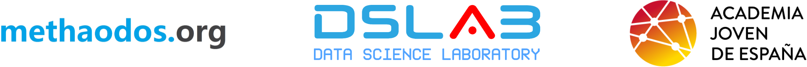

Los grupos de investigación methaodos.org y DSLAB en colaboración con la Academia Joven de España han realizado informes sobre la situación y evolución COVID-19 tanto en España como en los países más afectados por la pandemia. Estos informes tienen como punto central el Índice de Suficiencia Sanitaria que estudia la capacidad de un sistema para afrontar una pandemia como la actual. Hasta 29 de junio se han realizado <a href="https://github.com/URJCDSLab/website/tree/gh-pages/research/projects/covid19/informes_ejecutivos" target="_blank">informes diarios</a> y <a href="https://github.com/URJCDSLab/website/tree/gh-pages/research/projects/covid19/informes_semanales" target="_blank">semanales</a>.

A partir de octubre se realizarán informes mensuales con información semanal: 
 
<a href="https://dslab-website.s3.eu-central-1.amazonaws.com/20201002_COVID19_DSLAB_informe_ejecutivo.pdf" target="_blank">Informe ejecutivo a fecha 02 de octubre de 2020</a>
  

<!--   -->
<!-- <a href="https://dslab-website.s3.eu-central-1.amazonaws.com/20200717_COVID19_DSLAB_informe_semanal.pdf" target="_blank">Informe resumido consolidado a fecha 20 de julio de 2020</a> -->
<!--    -->

<!--   -->
<!-- <a href="https://dslab-website.s3.eu-central-1.amazonaws.com/20200629_COVID19_DSLAB_informe_semanal.pdf" target="_blank">Informe semanal a fecha 29 de junio de 2020</a> -->
<!--    -->

<!--   -->
<!-- <a href="https://dslab-website.s3.eu-central-1.amazonaws.com/20200622_COVID19_DSLAB_informe_semanal.pdf" target="_blank">Informe semanal a fecha 22 de junio de 2020</a> -->
<!--    -->

<!--   -->
<!-- <a href="https://dslab-website.s3.eu-central-1.amazonaws.com/20200615_COVID19_DSLAB_informe_semanal.pdf" target="_blank">Informe semanal a fecha 15 de junio de 2020</a> -->
<!--    -->

<!--   -->
<!-- <a href="https://dslab-website.s3.eu-central-1.amazonaws.com/20200608_COVID19_DSLAB_informe_semanal.pdf" target="_blank">Informe semanal a fecha 08 de junio de 2020</a> -->
<!--    -->

<!--   -->
<!-- <a href="https://dslab-website.s3.eu-central-1.amazonaws.com/20200601_COVID19_DSLAB_informe_semanal.pdf" target="_blank">Informe semanal a fecha 01 de junio de 2020</a> -->
<!--    -->

<!--   -->
<!-- <a href="https://dslab-website.s3.eu-central-1.amazonaws.com/20200525_COVID19_DSLAB_informe_semanal.pdf" target="_blank">Informe semanal a fecha 25 de mayo de 2020</a> -->
<!--    -->

 

 

Informe elaborado por los grupos de investigación DSLAB y methaodos.org de la Universidad Rey Juan Carlos, en colaboración con la Academia Joven de España.

 

{width=80%}

  

 

 
Este obra está bajo una <a rel="license" href="http://creativecommons.org/licenses/by-sa/4.0/" target="_blank">licencia de Creative Commons Reconocimiento-CompartirIgual 4.0 Internacional</a>.

